# grokking-dynamics

A small decoder-only transformer trained on modular addition mod 113, where the model reaches 100% training accuracy within a few hundred steps and then stays at low test accuracy for thousands more before generalization arrives abruptly. This repo reproduces that delayed-generalization curve across multiple seeds and then investigates what changes inside the network during the plateau — the window where every metric you'd normally watch is flat but the representation is evidently reorganizing. The task is deliberately tiny and fully specified: because the ground truth has known algebraic structure, claims about what the model encodes internally can be checked against the group structure rather than against intuition. Results are reported over multiple seeds with variance, since onset timing on this task is variable enough that single-run curves are misleading.

The implementation replicates Nanda et al. 2023, [*Progress Measures for Grokking via Mechanistic Interpretability*](https://arxiv.org/abs/2301.05217): a 1-layer transformer with no LayerNorm, biases, or dropout, trained on (a + b) mod 113.

## Status

| Stage | Goal | Status |
|---|---|---|
| 1 | Data, model, training: reproduce the grokking curve | **Done** |
| 2 | Reverse-engineer the learned algorithm (Fourier analysis of weights and activations) | **Done** |
| 3 | Progress measures (restricted / excluded loss) and the three training phases | **Done** |
| 4 | When does each seed commit to its key frequencies? | **Done** |

## Stage 1 results

**Setup:** all 12,769 pairs (a, b) with p = 113; a fixed seeded 30% / 70% train/test split; full-batch
AdamW (lr 1e-3, betas (0.9, 0.98), **weight decay 1.0**); 40,000 steps; 10 seeds, which differ only in
initialization. Runs were done on a Colab T4 GPU (versions in
[`results/01_baseline/ENVIRONMENT.txt`](results/01_baseline/ENVIRONMENT.txt)). Metrics were logged every 100 steps.

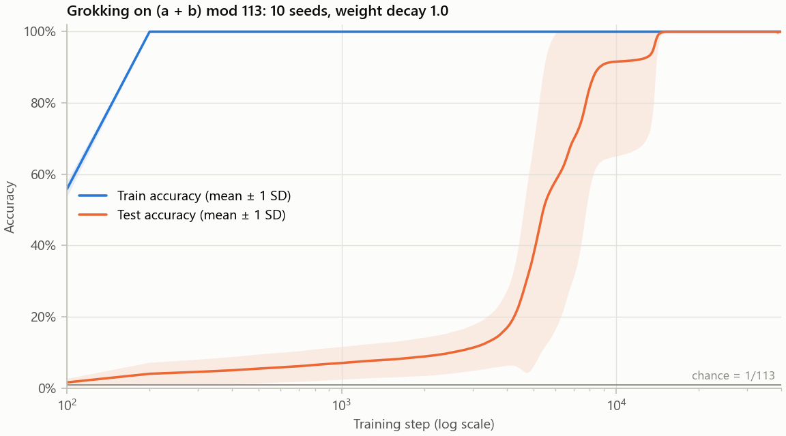

- **Memorization:** training accuracy passes 99% by step 200 in every seed.
- **Plateau:** test accuracy stays low for thousands of steps, but not flat at chance (1/113 ≈ 0.9%). It is 2–18%
  at step 1,000 across seeds and creeps upward before the jump.
- **Grokking:** test accuracy passes 90% between steps 4,800 and 14,300 (median 6,600), and no seed falls back
  below 90% afterwards.
- **Weight norm:** it rises to about 60 during memorization and falls to about 30 as the model generalizes.

| Seed | 0 | 1 | 2 | 3 | 4 | 5 | 6 | 7 | 8 | 9 |
|---|---|---|---|---|---|---|---|---|---|---|
| Train acc > 99% (step) | 200 | 200 | 200 | 200 | 200 | 200 | 200 | 200 | 200 | 200 |
| Test acc > 90% (step) | 5,600 | 5,200 | 6,300 | 5,400 | 8,600 | 4,800 | 8,600 | 8,000 | 6,900 | 14,300 |
| Final test acc | 100% | 100% | 99.73% | 100% | 100% | 100% | 100% | 100% | 100% | 100% |

Seed 2 settles at 99.73% (about 24 of 8,939 test pairs wrong) from step ~20,000 onward. This is stable, not a
training instability; the misclassified pairs have not been examined yet.

### Control: weight decay 0

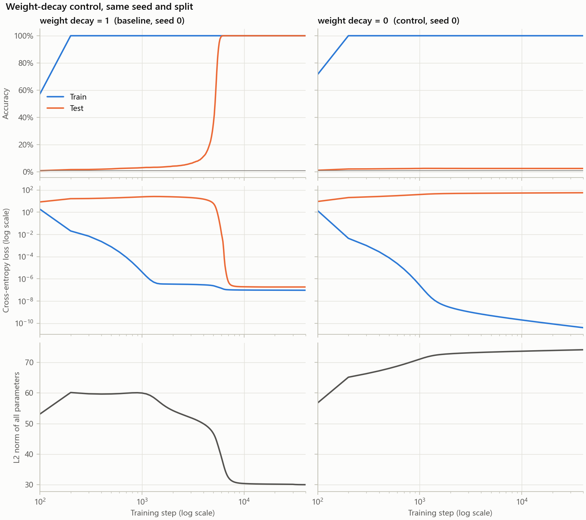

With weight decay set to 0 (same seed and split), the model memorizes by step 200 but **never generalizes**.
Test accuracy peaks at 2.5% and ends at 2.4%, while the weight norm keeps growing (42 → 74). Weight decay is what
drives grokking here.

### Verification
- **Reproducibility:** re-training seed 0 from scratch produces a byte-identical metrics CSV (on the same GPU and
  software versions).
- **TransformerLens port:** the ported model's logits match the from-scratch model to within 2.9e-5 on the trained
  model, over all inputs (the tolerance is 1e-4).
- **Tests:** the full suite (split determinism, seed reproducibility, weight port) passes on the GPU after training.

## Stage 2 results

**The hypothesis under test.** Nanda et al.'s "clock" algorithm: the model embeds each number on a small
number of circles — embedding *a* as cos/sin(w·a) for a few frequencies w = 2πk/113 — multiplies the
*a*-terms and *b*-terms together in attention and the MLP, and reads the answer off as cos(w(a + b − c)),
which is largest exactly when c = a + b.

All ten seeds were analysed from their final (step 40,000) checkpoints, on CPU. A frequency counts as
**key** if it carries at least **1% of the embedding's squared Frobenius norm** — a threshold fixed in
[`configs/fourier.yaml`](configs/fourier.yaml) before looking at any spectrum, and reported alongside the
full spectrum rather than tuned to make the count come out nicely.

### The embedding concentrates on a handful of frequencies

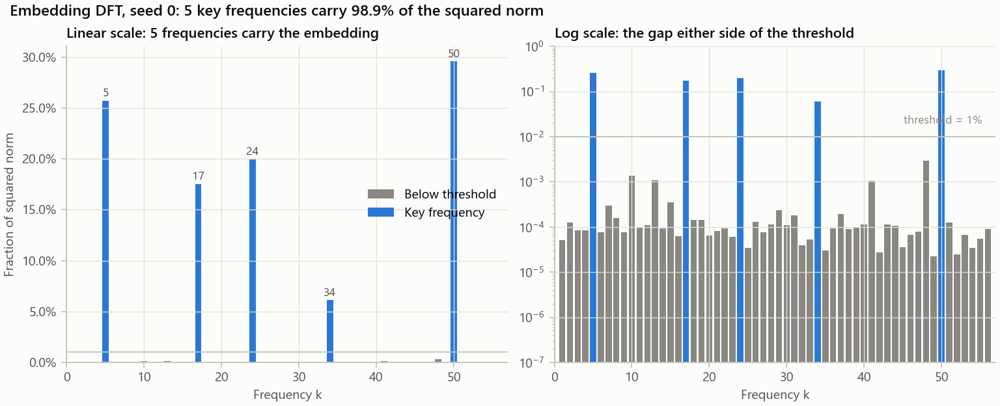

Every seed puts almost all of its embedding norm on **4 or 5 frequencies** (five in seven seeds, four in
seeds 1, 4 and 6), carrying **90.4% to 99.0%** of the squared norm. The threshold is not doing delicate
work: the largest *excluded* frequency is between 0.13% and 0.96% across seeds, so nothing sits ambiguously
on the line, though seeds 2, 4 and 6 come closest (0.82–0.96%).

| Seed | 0 | 1 | 2 | 3 | 4 | 5 | 6 | 7 | 8 | 9 |
|---|---|---|---|---|---|---|---|---|---|---|
| Key frequencies | 5 17 24 34 50 | 5 17 32 48 | 4 5 20 27 40 | 6 21 25 26 44 | 21 33 46 56 | 5 29 42 45 48 | 4 5 8 35 | 14 23 30 33 45 | 3 6 21 26 51 | 17 19 34 51 56 |
| Share of squared norm | 98.9% | 98.2% | 93.9% | 97.9% | 90.4% | 99.0% | 97.3% | 98.8% | 98.7% | 98.9% |

**No two seeds choose the same set.** No frequency appears in all ten runs; the most common (k = 5) appears
in five. Which frequencies a model uses is an initialization lottery — but *how many*, and the structure
built on them, is not. The split is fixed across seeds, so this is caused by initialization alone.

### The logits are built out of those frequencies

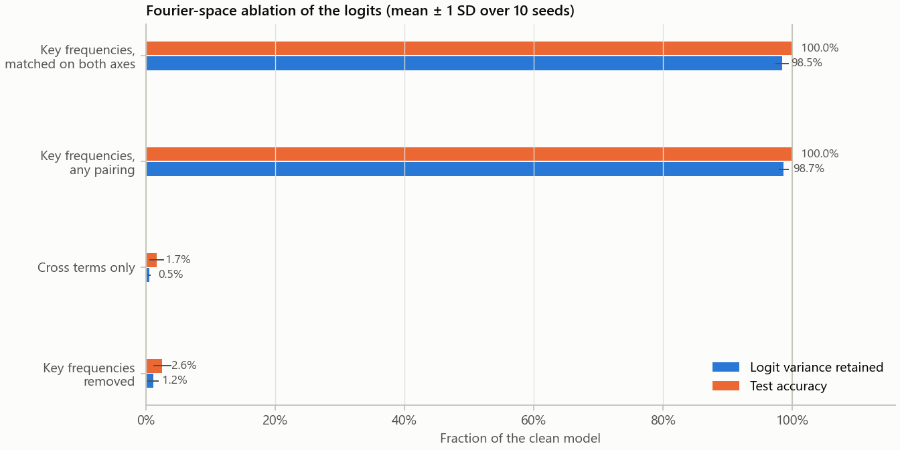

Logits are centred over the answer axis first, since softmax ignores a per-example constant and leaving it
in would inflate every number below.

| Kept | Logit variance retained | Test accuracy |
|---|---|---|
| Key frequencies, matched on both input axes | **98.5% ± 1.0%** (min 95.9%) | **100% in every seed** |
| Key frequencies, any pairing | 98.7% ± 0.8% | 100% in every seed |
| Cross terms only | 0.5% | 1.7% |
| Everything *except* the key frequencies | 1.2% | 2.6% |

Reconstructing the logits from the key frequencies **matched on both axes** — the components
cos(w(a + b − c)) actually expands into — retains 98.5% of the variance and full test accuracy. Allowing
*any* pairing of key frequencies adds only 0.2 points, so the computation really does live on the
matched-frequency diagonal rather than using cross-frequency terms. Removing the key frequencies collapses
the model to 2.6% test accuracy (chance is 0.88%).

### Neurons work at a single frequency, but are not functions of a + b alone

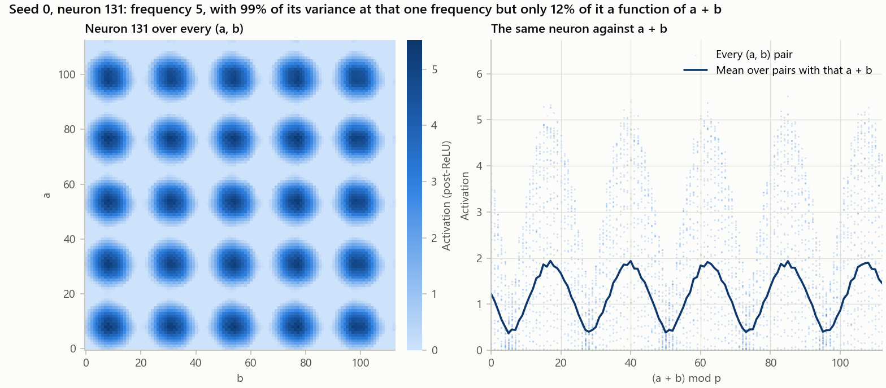

This is where the simple form of the hypothesis fails, and the failure is informative.

- Counting **every term at a neuron's best single frequency** (terms in *a*, in *b*, in *a + b*, in
  *a − b*), the median neuron has **94–97%** of its variance explained, and **292–465 of 512** neurons per
  seed clear 90%.
- Counting **only cos/sin(w(a + b))**, the median falls to **12–18%**, and **zero of 512** neurons in any
  seed clear 90%.

That gap is expected rather than a contradiction. A neuron computing cos(w·a)·cos(w·b) is *entirely*
single-frequency, yet only half a function of a + b, because
cos(w·a)cos(w·b) = ½[cos(w(a + b)) + cos(w(a − b))]. The a − b half is real structure that cancels across
the population when the MLP is read out, not inside any individual neuron. Consistent with that, neurons
sharing a frequency have phases spread around the circle (mean circular resultant 0.12, max 0.49, where 0
is uniform and 1 would be identical phases).

### Attention is not just a router

A follow-up asked whether attention participates in the algorithm or merely pours *a* and *b* into the
final position. Two findings, across all ten seeds ([`results/02_attention/`](results/02_attention)):

**Attention here is fully characterised, not merely sampled.** The final position always holds `=` and
the model has no LayerNorm, so the residual stream there *before* attention is `W_E[113] + W_pos[2]` —
the same vector for every input. The query is therefore constant, and the three attention scores reduce
to a function of *a* alone, a function of *b* alone, and a constant. Measured: the query's spread over
all 12,769 inputs is exactly **0.0** in every seed, and the departure from that factorisation is at most
**2.6e-7**, which is floating-point noise. So each head's attention is two 1-D functions of 113 values
plus a scalar — about 900 numbers for the whole layer. This is a direct payoff of the no-LayerNorm
choice.

**But it is strongly input-dependent.** Averaged over inputs the pattern looks like a boring symmetric
router: 0.479 on *a*, 0.479 on *b*, 0.042 on `=`, with the *a* and *b* weights differing by at most
0.0022 — the commutativity of addition showing up directly in the weights. The per-input standard
deviation, however, is 0.29. Replacing the pattern with that mean, making it a genuinely fixed router,
drops test accuracy from 100% to **48% ± 11%**, in every seed.

Mean-ablating a single head costs 41–48 accuracy points on average, but *which* head matters is
seed-dependent (individual seeds range from 12% to 88%), so there is no consistent head specialisation.

**This means the picture above is incomplete.** The key frequencies carry the computation, but attention
is not a passive mixer feeding them — freezing it costs about as much as deleting an entire head. What
attention computes with its two 1-D functions is not yet established.

### Seed 2's 24 errors

Seed 2 is the one seed that never reaches 100%. Its 24 wrong test pairs
([`misclassified.csv`](results/02_fourier/misclassified.csv)) are sharply clustered: they involve only
**12 distinct values** of *a* or *b*, and land on only **8 distinct correct answers**, four of them with
a = b. The defect is localized in the circuit rather than spread over the input space.

### Verification

- **Number of key frequencies:** 4 or 5 per seed, at a 1% threshold declared in advance.
- **Fraction of clean logit variance the key-frequency-only model retains:** 98.5% ± 1.0% across seeds,
  at 100% test accuracy in all ten.
- **Does it match the paper?** Qualitatively yes: a sparse, single-digit set of frequencies, with the
  computation concentrated on matched frequencies and collapsing when they are removed. The one place our
  result is weaker than a naive reading of the paper is at the neuron level — individual neurons are not
  well-approximated by cos/sin(w(a + b)) alone, for the algebraic reason above. We have **not** re-derived
  the paper's exact per-run numbers for a quantitative comparison, so "matches" here means structural
  agreement, not a matched statistic.

## Stage 3 results

**The question.** Test accuracy sits near chance for thousands of steps and then jumps. Is the circuit
being built during that plateau, invisibly? Two measures from Nanda et al. (Section 5.1) answer this at
every checkpoint, using each seed's key frequencies from Stage 2:

- **Restricted loss:** the loss when the logits keep *only* the constant term and the cos/sin(w_k(a + b))
  terms at the key frequencies. Low means the circuit alone already gets answers right.
- **Excluded loss:** the loss on training pairs when *only* those terms are removed. Rising means the
  model has started relying on the circuit instead of memorized answers.

All 81 checkpoints of all ten seeds were measured on CPU. Before any measure was trusted, the clean
losses it recomputes were checked against the Stage 1 CSVs: at all 32 shared steps per seed they agree to
within 5e-6 (relative), accuracies agree exactly, and the parameter norm is bit-identical.

**Phase boundaries were pre-registered.** The paper places them by eye. Here the rules were written into
[`configs/progress.yaml`](configs/progress.yaml) and committed before any measure had been computed:
memorization ends at the minimum of excluded loss; cleanup starts when full-model test loss drops below
ln 113 (a uniform guess); cleanup ends at 99% test accuracy.

### The circuit is built long before test accuracy moves

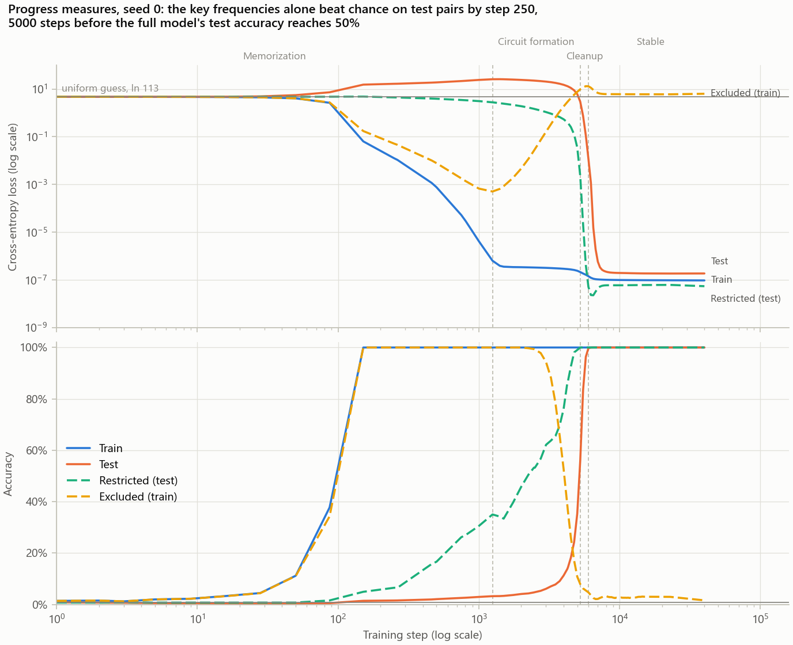

In seed 0, the key frequencies alone reach **30% test accuracy by step 1,000 and 99% by step 5,000**. At
those same steps the full model is at 3% and 35%. The memorized part of the network is hiding a circuit
that already generalizes. Before the jump, restricted loss on test pairs stays within 25% of its value
on training pairs, which is what a general algorithm looks like, not memorization. Meanwhile excluded loss bottoms out at step
1,250 and then climbs by more than four orders of magnitude before the jump, as the model shifts its
training-set performance onto the circuit.

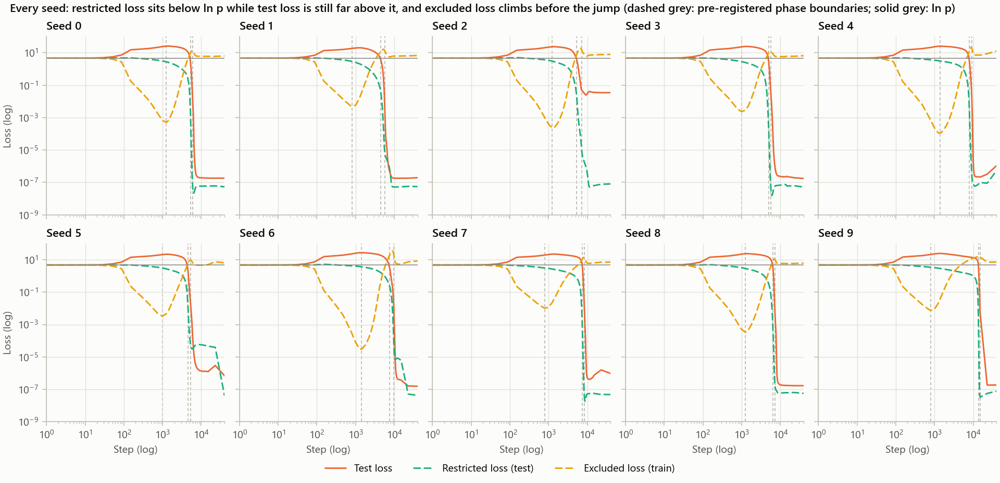

The same shape appears in every seed. From memorization end to cleanup start, excluded loss rises
**1,100x to 600,000x**.

### Phase boundaries per seed

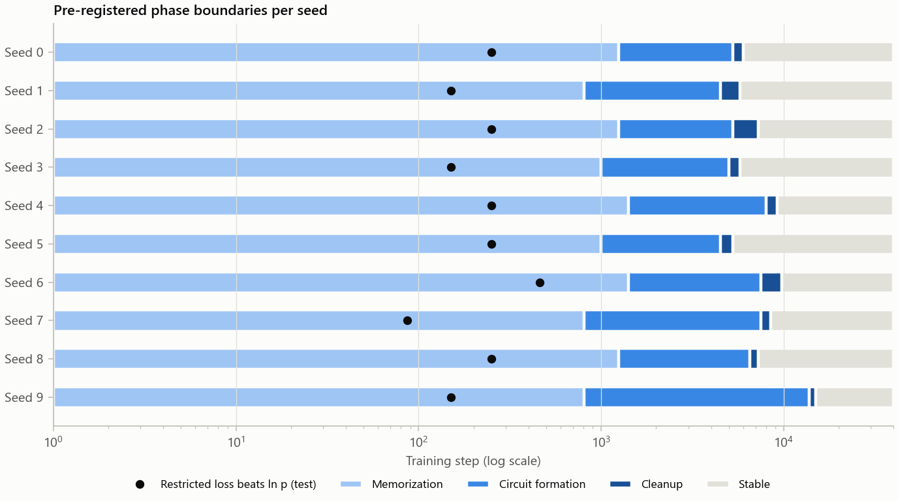

| Seed | 0 | 1 | 2 | 3 | 4 | 5 | 6 | 7 | 8 | 9 | Median (range) |
|---|---|---|---|---|---|---|---|---|---|---|---|
| Memorization ends | 1250 | 806 | 1250 | 1000 | 1409 | 1000 | 1409 | 806 | 1250 | 806 | 1125 (806–1409) |
| Cleanup starts | 5250 | 4500 | 5250 | 5000 | 8000 | 4500 | 7500 | 7500 | 6500 | 13750 | 5875 (4500–13750) |
| Cleanup ends | 6000 | 5750 | 7250 | 5750 | 9250 | 5250 | 9750 | 8500 | 7250 | 15000 | 7250 (5250–15000) |

Steps are checkpoint steps, resolved to 250 through step 15,000. **Memorization ends between steps 806 and
1,409 in every seed; when the circuit takes over varies threefold**, and seed 9 is the outlier, as in
Stage 1. For comparison, the paper reports 0–1.4k / 1.4k–9.4k / 9.4k–14k for its main run.

### Does restricted loss improve before the visible jump? Yes, by thousands of steps

| Marker | Step (median, range) | Lead over the jump to 50% test accuracy |
|---|---|---|
| Restricted test loss drops below ln 113 (pre-registered) | 250 (87–462) | **5,750 steps** (4,250–13,599) |
| Restricted test accuracy reaches 50% (post hoc) | 1,750–6,500 | **3,000 steps** (2,040–7,250) |

The pre-registered marker fires almost as soon as training starts, so its lead mostly restates when the
jump happens. The second marker is more informative, but it was chosen **after** seeing the curves and is
labelled as such. When it fires, the full model's test accuracy is still only 4–20%.

### Where this differs from the paper, and caveats

- **Restricted loss does not stay high during memorization.** The paper describes it that way. Here it
  drops below chance within the first 87–462 steps, and from there to the jump it decreases at every
checkpoint in every seed. Cleanup is also
  shorter than in the paper (750–2,250 steps). We report this, not explain it. Candidate causes include the
  deviations listed under Design decisions (no warmup, p + 1 outputs), but none has been tested.
- **"20 terms" is ambiguous in the paper.** Section 5.1 names only cos/sin(w_k(a + b)) but counts four
  2D terms per frequency, which would also include a − b terms. Both readings were computed (`_products`
  columns). The broader reading shifts memorization end 0–250 steps earlier and leaves the restricted-loss
  marker in the same 87–462 range. No conclusion changes.
- **Key frequencies come from the final model** (Stage 2, from W_E) and are applied at every checkpoint,
  as the paper does, though its extra seeds took them from W_L. A circuit built on frequencies the final
  model later abandoned would be invisible to these measures.
- **Two boundary rules pick the same checkpoint.** "Test loss below ln 113" and "test accuracy reaches
  50%" land on the same step in 9 of 10 seeds (seed 2: 5,250 vs 5,500), so they are not independent
  evidence.
- Gini coefficients, the paper's third measure, were not computed; the spec asked only for restricted and
  excluded loss.

### Verification

- **Phase boundaries per seed and spread:** table above. Memorization end is 806–1,409, cleanup start is
  4,500–13,750, and cleanup end is 5,250–15,000.
- **Does restricted loss improve before the visible test-accuracy jump?** Yes, in all ten seeds.
  Restricted test loss drops below chance a median **5,750 steps** before test accuracy reaches 50%
  (pre-registered). Restricted accuracy reaches 50% a median **3,000 steps** before it (post hoc).
- **Matches the paper?** Qualitatively, the central claim holds: the circuit forms well before grokking,
  and excluded loss rises as memorization is replaced. It does not match the paper's description of
  restricted loss during memorization, and the phase timings differ. We have not re-derived the paper's
  per-run numbers.

## Stage 4 results: when is the frequency set decided?

**The question.** Every seed ends up using a different set of key frequencies (Stage 2), and those
frequencies already carry useful signal a few hundred steps into training (Stage 3). So when is a seed's
set decided? Is it already latent in the random initialization, chosen early, or settled only after other
frequencies compete?

The frequency spectrum of two matrices was tracked at every checkpoint: the embedding **W_E**, and the
map from MLP neurons to logits, **W_L = W_out · W_U**. The tests, rules and their interpretation were
written into [`configs/frequency_timing.yaml`](configs/frequency_timing.yaml) and committed before
anything was computed. Two further analyses, chosen after seeing the results, are labelled **post hoc**.

### Pre-registered results

**1. There is a detectable, but small, head start at initialization.** At step 0, before any training,
the frequencies a seed will eventually use already rank higher in its random embedding than chance. Pooled
over all 47 key frequencies in 10 seeds, their mean rank is **23.6 of 56, against 28.5 ± 2.3 for random
picks (one-sided permutation test, p = 0.016)**. The same test on W_L, the secondary matrix, gives 24.9
(p = 0.057, not significant). Initialization tilts the odds; it does not decide the outcome. Only 14 of
the 47 final frequencies start in the top ten.

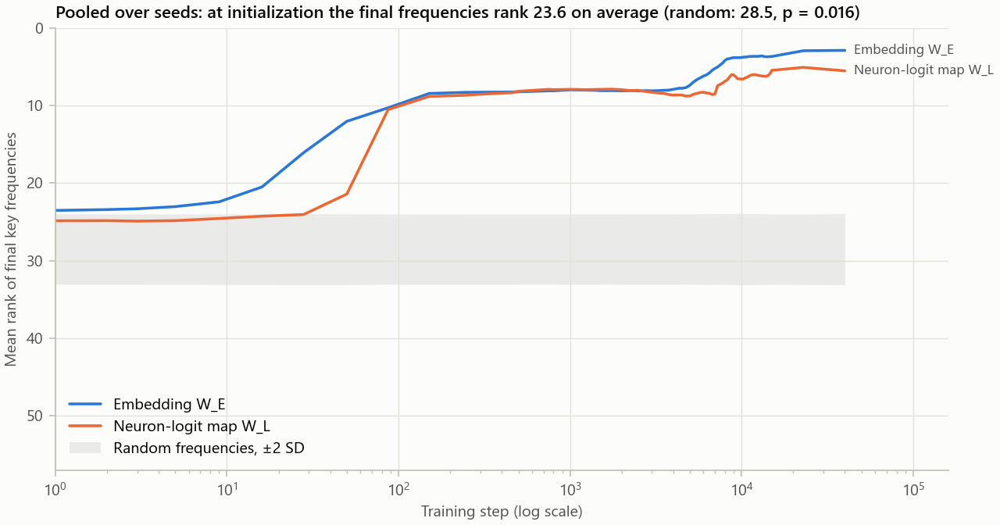

**2. The exact final set usually settles late.** The rule "the top-n frequencies of W_E equal the final
set at every later checkpoint" first holds during memorization in only 2 seeds (steps 151 and 151). In the
other 8 it holds only at steps 6,500–40,000. For W_L the rule never holds in 5 seeds, and the reason is itself
a finding. **In all five (seeds 0, 3, 5, 7, 8), the final W_L puts at most 0.01% of its norm on one of
W_E's five key frequencies.** Its top five therefore includes a noise frequency and can never match. In
other words, in 5 of the 7 seeds that Stage 2 counted as using five frequencies, the readout from neurons
to logits uses only four. The fifth is in the embedding but not in the readout. This is a limit of the
pre-registered rule, reported as it came out, and it qualifies the Stage 2 count.

### Post hoc: a core set chosen in the first few hundred steps, and a late minor frequency

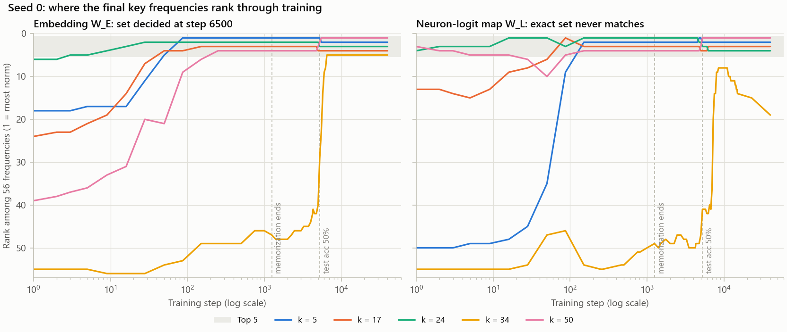

The exact-set rule hides a two-tier pattern, visible once each frequency is tracked separately.

- **Core frequencies, 35 of 47:** each one enters W_E's top n for good between **step 0 and step 462**,
  before memorization ends in its seed. These are the major ones, with a median 24.9% of the final
  embedding norm.
- **Late frequencies, 12 of 47:** they lock in only between **steps 3,500 and 40,000**, which covers
  circuit formation, cleanup and after. They are the minor ones, with a median 6.4% of the final norm; in
  every case they are the 3rd-largest or smaller in their seed. Four of the 12 never lock into W_L's top n,
  against 1 of the 35 core frequencies.

In seed 0, frequencies 5, 17, 24 and 50 are in place by step 250. Frequency 34 ranks 55th of 56 at
initialization, enters the top five only at step 6,500 (after the jump), and ends with 6% of the norm.
The readout never uses it.

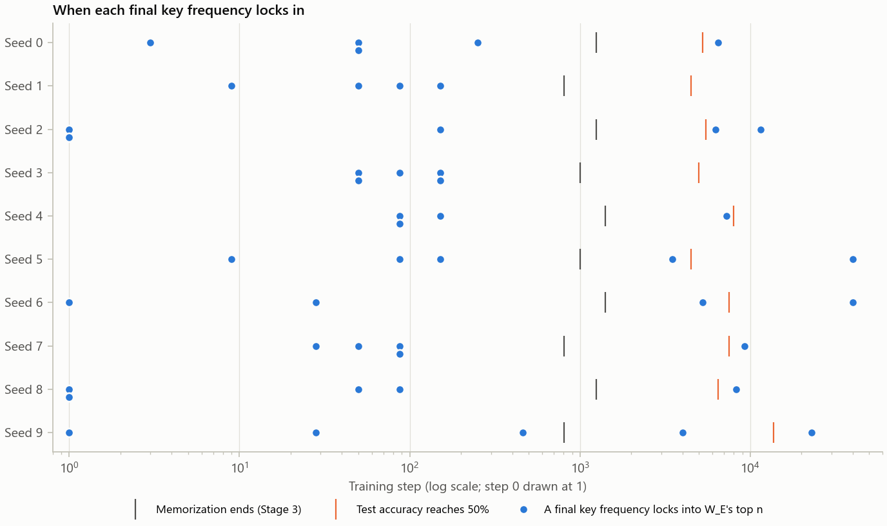

**Other frequencies do work during circuit formation, and are then replaced.** At each checkpoint, restricted
loss was also computed with that checkpoint's *own* top-n frequencies instead of the final set. In 7 of 10
seeds the own set gives **11–25 points higher restricted test accuracy** at some point during training.
The frequency that is later abandoned is carrying real signal at that point. For example, seed 5 keeps
frequency 24 in its top five until step 22,901 before frequency 29 replaces it; seed 9 keeps frequency 30
until step 13,250, and frequency 51 is in place for good by step 22,901.

### What this means, and caveats

The main frequencies of the circuit are chosen almost immediately, from a starting position that slightly
favours them. The last one or two slots stay open far longer, and the model replaces frequencies it has
been using as late as cleanup.

- The initialization effect is statistically detectable, not large. It rests on one pooled test over 10
  seeds, the single test pre-registered as primary.
- The core/late split, the frequency-share comparison and the own-set comparison were all chosen after
  seeing results. They describe these 10 runs; they were not tested as hypotheses.
- Past step 15,000 checkpoints are sparse (15,000 → 22,901 → 40,000). In seeds 5 and 6 the set first
  matches at the final checkpoint, so it may have settled any time after 22,901.
- "Top n by embedding norm" shows where the weight is, not what the model uses. The restricted-loss
  comparison is the evidence that a non-final frequency was actually in use.
- A causal test, such as planting chosen frequencies in the initialization and retraining, would need GPU
  training and has not been run.

## Repository layout

```
configs/           one YAML per experiment (every hyperparameter lives here)
src/data.py        dataset and seeded train/test split
src/model.py       from-scratch transformer + to_hooked_transformer() (TransformerLens port)
src/train.py       full-batch training loop, CSV logging, checkpointing, determinism settings
src/fourier.py     Fourier basis, embedding DFT, neuron fits, Fourier-space ablation (Stage 2)
src/attention.py   attention pattern factorisation and ablations (Stage 2)
src/measures.py    restricted / excluded loss and pre-registered phase-boundary rules (Stage 3)
src/frequency_timing.py  frequency ranks through training, lock-in rule, init permutation test (Stage 4)
experiments/       one script per numbered experiment, plus regenerate_checkpoints.py
results/           raw metrics as CSV (committed), environment record, run logs
figures/           make_all.py regenerates every figure from results/ without retraining
colab/             notebooks and bundling script for running on a Colab GPU
tests/             split determinism, seed reproducibility, TransformerLens port
```

## Setup

```
pip install -r requirements.txt
python -m pytest tests
```

## Running

The configs set `runtime.device: cuda`, so training needs a CUDA GPU. To run on a CPU instead, copy a config
under a new name with `device: cpu`. CPU and GPU results are not bit-identical, so they must not overwrite each
other's CSVs.

```
# one seed / many seeds (--jobs = seeds run in parallel processes)
python experiments/01_baseline.py --config configs/baseline.yaml --seed 0
python experiments/01_baseline.py --config configs/baseline.yaml --seeds 0-9 --jobs 2

# weight-decay control
python experiments/01_baseline.py --config configs/baseline_wd0.yaml --seed 0

# Stage 2 Fourier analysis: reads the final checkpoint of each seed, writes results/02_fourier/.
# CPU only, a few minutes; needs checkpoints on disk (see regenerate_checkpoints.py below).
python experiments/02_fourier.py --config configs/fourier.yaml

# Stage 3 progress measures: every checkpoint of every seed, writes results/03_progress/.
# CPU only, ~8 minutes; checks recomputed clean metrics against the Stage 1 CSVs first.
python experiments/03_progress.py --config configs/progress.yaml

# Stage 4 frequency timing: spectra of W_E and W_L at every checkpoint, writes results/04_frequency_timing/.
# CPU only, ~10 minutes.
python experiments/04_frequency_timing.py --config configs/frequency_timing.yaml

# figures and milestone table, from committed CSVs only (no training)
python figures/make_all.py

# checkpoints are not committed: regenerate them, verifying the CSVs reproduce byte-for-byte
python experiments/regenerate_checkpoints.py --all --jobs 2
```

Outputs:
- **Metrics:** `results/{experiment}/{config}_seed{k}.csv`. Columns: step, train/test loss, train/test accuracy,
  and the L2 norm of all parameters. A row is written every 100 steps and flushed immediately.
- **Checkpoints:** `checkpoints/{experiment}/{config}_seed{k}/stepNNNNNN.pt`. Two schedules, unioned:
  - **~20 log-spaced steps plus step 0**, saved in full, with optimizer and RNG state (~2.6 MB each).
  - **Every `train.checkpoint_every` steps up to `train.checkpoint_every_until`**, saved weights-only
    (~0.87 MB each). Log spacing straddles the transition — seed 0 groks between steps 5,000 and 6,000,
    entirely inside the 4,297 → 7,506 gap — so the progress measures in Stage 3 need uniform resolution
    through it. These are weights-only because restricted and excluded loss only run the model forward.

  The baseline config uses 250 and 15,000, giving 81 checkpoints per seed (21 full + 60 weights-only,
  ~107 MB per seed). Everything has settled well before step 15,000; the latest seed groks at 14,300.
  Checkpoint saving does not touch training: recomputing train/test loss, accuracy and parameter norm
  from all 320 checkpoints that land on the logged step grid reproduces the committed CSV rows exactly
  (zero difference in every column, on the GPU that produced them).

### On Colab

1. Run `python colab/make_bundle.py` to build `colab/grokking-dynamics.zip`. The bundle includes the
   committed CSVs in `results/`, which `regenerate_checkpoints.py` needs in order to verify anything.
2. At colab.research.google.com, use File → Upload notebook. Choose a T4 GPU runtime and Run all, then
   upload the zip when asked.
   - `colab/stage1_colab.ipynb` trains the baseline and control from scratch and draws the figures.
     Its last cell downloads `stage1_results.zip`; unzip it into the repo root and move its `logs/`
     folder to `results/01_baseline/colab_logs/`.
   - `colab/stage3_checkpoints.ipynb` re-runs the ten baseline seeds to produce the dense checkpoints,
     re-verifying as it goes: it byte-compares the regenerated metrics against the committed CSVs, then
     recomputes metrics from the saved checkpoints and compares those too. It downloads one zip per
     seed, so a dropped download costs only that seed.

## Design decisions

- **Architecture:** no LayerNorm, no biases, no dropout, no learning-rate schedule. The TransformerLens port
  zeroes every TransformerLens bias.
- **No warmup:** the paper's reference code used a 10-step linear LR warmup. It is omitted here to keep the
  optimizer schedule-free.
- **Output vocabulary is p + 1**: the `=` token is a possible, never-correct output, matching the reference code.
  Accuracy is the argmax over all p + 1 logits.
- **Loss is computed in float64**, as in the reference code, so very small losses don't underflow in float32.
- **Initialization** follows the reference code: all weights ~ N(0, 1/d_model) except W_U ~ N(0, 1/d_vocab).
- **Split:** `data.split_seed` is fixed across training seeds, so `--seed` varies only the initialization.
- **Device** comes from the config (`cpu` or `cuda`). There is no silent fallback, because results must come from
  the device their config names.
- **Speed:** training evaluates only the final position, and Q/K/V are computed from pre-projected embedding
  tables. Both are exact identities for a 1-layer causal model and are covered by tests.
- **Reproducibility:** deterministic algorithms, a fixed thread count, TF32 disabled, and deterministic cuBLAS.
  Byte-identical CSVs are expected on the same hardware with the same library versions.

## License

MIT (see [LICENSE](LICENSE)).
